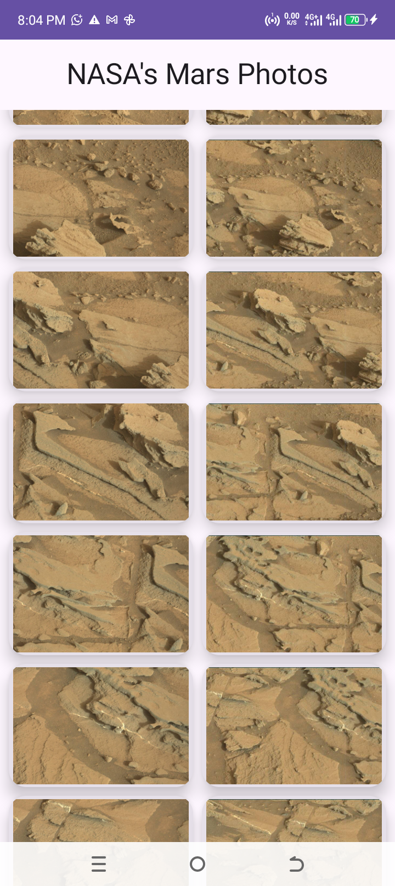
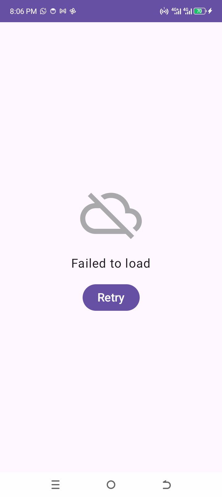

# Mars Photos – Android Demo App

Mars Photos is a demo Android application that displays actual images of Mars captured by NASA’s rovers. The app consumes a RESTful web service to retrieve photo data and presents it in a scrollable grid layout using Jetpack Compose.

## ✨ Features

- Retrieves Mars photos from NASA’s open API.
- Displays images in a lazy-loading grid.
- Uses Kotlin coroutines for asynchronous operations.
- Implements manual dependency injection.
- Clean architecture with ViewModel and Repository pattern.

## 🧰 Tech Stack

- **Language**: Kotlin
- **UI Toolkit**: Jetpack Compose
- **Network**: [Retrofit](https://square.github.io/retrofit/)
- **Serialization**: [kotlinx.serialization](https://github.com/Kotlin/kotlinx.serialization)
- **Image Loading**: [Coil](https://coil-kt.github.io/coil/)
- **Architecture Components**: ViewModel, Repository
- **Build System**: Gradle

## 📸 Screenshots
 
## 🚀 Getting Started

### Prerequisites

You should be familiar with:
- Jetpack Compose & Composable functions
- ViewModel and repository architecture
- Coroutines for background tasks
- LazyVerticalGrid / LazyColumn

### Setup Instructions

1. [Install Android Studio](https://developer.android.com/studio) (latest version).
2. Clone the repository 
